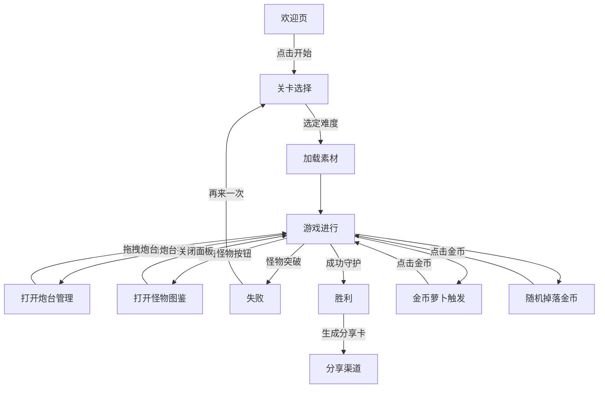

## 1. 项目概览

**一句话核心卖点**：萌系塔防《保卫萝卜》轻量网页版——动态间隔怪物 + 多元金币 + 炮台/怪物信息面板，30 秒上手，120 秒一局，截图分享无负担。
**情绪关键词**：温馨、治愈、轻策略、持续挑战、社交分享
**目标分享载体**：朋友圈、微博、小红书、微信群聊

---

## 2. 功能清单

| #  | 功能模块                       | 说明                                                            | 交互时长目标      |
| -- | -------------------------- | ------------------------------------------------------------- | ----------- |
| 1  | 欢迎页                        | Logo + 「开始守护」按钮；自动淡入淡出                                        | ≤ 3 s       |
| 2  | 关卡选择                       | 3 个难度（萌新 / 进阶 / 地狱）                                           | ≤ 5 s       |
| 3  | **怪物生成管理**                 | 对象池（Object Pool）+ `spawnMonsterWave(interval)` 控制怪物批次，随难度调整间隔 | 持续          |
| 4  | 游戏主界面                      | 固定路径；3 种萝卜炮台；5 轮怪物                                            | 90 s 通关     |
| 5  | 资源管理                       | 金币随击杀掉落；悬浮数字动画                                                | 实时          |
| 6  | **金币萝卜**                   | 指定空地种植；每 3–7 s 随机冒出金币；点击收集                                    | 持续          |
| 7  | **随机掉落金币**                 | 顶部随机坠落；点击立取                                                   | 即时          |
| 8  | **炮台管理区域（Tower Workshop）** | 侧边抽屉面板显示已解锁的萝卜炮台卡片：消耗金币、射程、射速、DPS、技能标签；支持拖拽上阵 & 升级            | ≤ 5 s 开启/关闭 |
| 9  | **怪物图鉴区域（Monster Codex）**  | 侧边抽屉显示各类怪物：血量、移动速度、抗性、掉落、特殊技能；战前 / 暂停时可查看                     | ≤ 5 s 开启/关闭 |
| 10 | 游戏结束页                      | 胜 / 败结算 + 分享按钮                                                | ≤ 10 s      |
| 11 | 音效开关                       | 背景音乐 / 击打音                                                    | 即时          |
| 12 | 数据本地存储                     | localStorage 记录最高分、金币总量、解锁炮台                                  | 持久化         |
| 13 | 分享卡片                       | html2canvas 截图生成长图                                            | ≤ 3 s       |

---

## 3. 文件结构示例

```text
carrot-defense/
├── index.html          # 欢迎页 & 关卡选择
├── game.html           # 主游戏逻辑
├── assets/
│   ├── img/            # PNG/SVG 精灵图
│   ├── audio/          # BGM & SFX
│   └── style/          # color.css / typography.css
├── js/
│   ├── engine.js       # 怪物行进 & 碰撞判定
│   ├── spawner.js      # 对象池 & 间隔生成函数
│   ├── gold.js         # 金币萝卜 & 随机金币逻辑
│   ├── turrets.js      # 炮台数据 & 升级逻辑
│   ├── codex.js        # 怪物图鉴 & 数据查询
│   ├── ui.js           # 动画 & 事件绑定
│   └── storage.js      # localStorage API
├── manifest.webmanifest
└── README.md
```

---

## 4. 核心交互流程（Mermaid 文本）



---

## 5. 视觉动效指导

* **色系**：主色 #FFB84C、辅色 #96E6B3、背景 #FFF9EC。
* **字体**：标题—ZCOOL KuHei；正文—Noto Sans SC。
* **动画**：

  * 怪物出场淡入 ≤ 400 ms，路径移动 keyframes 匀速
  * 金币萝卜冒出 `scale → bounce` ≤ 300 ms
  * 随机金币下落 `anime.js` 抛物线，击中后消失 ≤ 200 ms
  * 炮台 / 图鉴面板：右侧滑入/滑出 ≤ 250 ms，背景蒙层 0.3 α
* **UI**：卡片圆角 24 px，按钮阴影 0 2 8 rgba(0,0,0,.1)。

---

## 6. 技术约束

* **前端栈**：HTML5 + CSS3 + ES6；anime.js（< 15 kB）与 html2canvas。
* **对象池模式**：`spawner.js` 维护 monsterPool\[]，复用实例，减少 GC。
* **数据驱动**：`turrets.js` 与 `codex.js` 暴露 JSON 配置数组，便于平衡数值。
* **兼容性**：Chrome 90+、Safari 14+、Edge 90+、移动 WebView。
* **性能**：首屏 < 2 s；帧率 ≥ 50 FPS；资源 ≤ 2 MB。
* **禁止**：React/Vue 等框架、服务器端依赖、重型物理引擎。

---

## 7. SEO & 分享策略

* OG 标签：`og:title`、`og:image` 指向动态分享卡。
* PWA：manifest + Service Worker 提供离线体验。
* Hash 记录：`/#level-1&turret=3&coins=1000` 保留通关与金币状态。

---

## 8. 开发里程碑（2 周 Sprint）

1. **Day 1–2** 需求补充、UI 迭代（面板设计）
2. **Day 3–5** 实现 `spawner.js`、动态怪物生成
3. **Day 6–7** `gold.js` 金币系统；`turrets.js` 基础数据
4. **Day 8–9** `codex.js` 怪物图鉴；面板交互
5. **Day 10** UI 动效联调、音效补齐
6. **Day 11–12** 性能优化、内存 & FPS 基准测试
7. **Day 13–14** Beta 内测 & 部署、宣传素材

---

## 9. 质量保证清单

* ✔ 对象池内存泄漏检测
* ✔ 功能回归：怪物波次、金币收集、面板数据同步
* ✔ Lighthouse Performance ≥ 90，Accessibility ≥ 90
* ✔ 键盘 / 触控 100 ms 内反馈
* ✔ 单元测试：`spawnMonsterWave`、金币产出、炮台 DPS 计算

---

## 10. 交付物列表

1. 静态源码包 (.zip)
2. 离线 PWA 版本
3. 更新后设计稿（Figma / PDF）
4. README：部署、面板 API 与数值平衡指南
5. 10 秒 DEMO 录屏（含炮台管理 & 图鉴演示）

---

## 补充说明：
1. 游戏画布选择canvas；2. 路线选择弯弯曲曲的直线，但是要保留弹性，为后续开发曲线；3. 三种萝卜炮台：单体攻击、群体攻击和减速型，4. 难易差异体现在怪物血量、速度、数量、生成速度等而非炮台价格；5. 炮台面板功能需要拖拽功能；怪物图鉴可以实时显示当前场上怪物状态

游戏开始之后，开始第一波，如果能够在生命>0的前提之下击打当前波次的所有怪物，则会等待10S，然后进入下一波。


 怪物的血量应该使用进度条的形式，击打掉的血量应该是空的
 根据当前剩余血量使用不同的颜色：60%以上绿色，20%以上黄色，20%之下红色